# Web Search Module - 架构设计文档

## 项目概述

本项目旨在复刻SearXNG的核心功能，实现一个简单但强大的元搜索引擎。我们将重点关注中国地区的搜索需求，提供高质量、无广告、隐私保护的搜索体验。

## 架构设计

### 整体架构

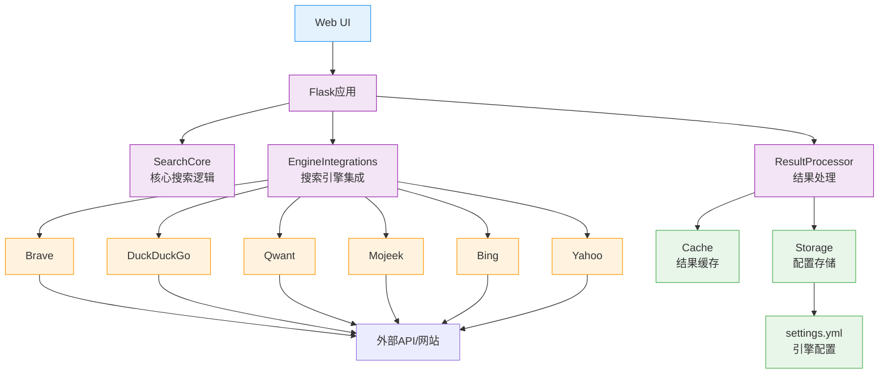

## 搜索引擎选择

### 引擎权重与类别

| 搜索引擎   | 通用搜索 | 图片搜索 | 新闻搜索 | 综合权重 |
| ---------- | -------- | -------- | -------- | -------- |
| Brave      | 1.5      | 1.5      | 1.5      | 1.5      |
| DuckDuckGo | 1.2      | 1.2      | 1.2      | 1.2      |
| Qwant      | 1.0      | 1.0      | 1.0      | 1.0      |
| Mojeek     | 0.8      | 0.8      | 0.8      | 0.8      |
| Bing       | 1.0      | 1.0      | 1.0      | 1.0      |

### 引擎配置表

| 引擎名称 | 权重 | 类别 | 状态 | 说明 |
|---------|------|------|------|------|
| **Brave** | 1.5 | general, images, news | 启用 | 优质结果，隐私保护 |
| **DuckDuckGo** | 1.2 | general, images, news | 启用 | 无广告，隐私第一 |
| **Qwant** | 1.0 | general, images, news | 启用 | 欧洲引擎，无追踪 |
| **Mojeek** | 0.8 | general | 启用 | 英国引擎，无广告 |
| **Bing** | 1.0 | general, images, videos | 启用 | 微软引擎，高质量结果 |
| **Yahoo** | 0.9 | general, news | 启用 | 聚合搜索 |

## 结果过滤策略

### 过滤流程

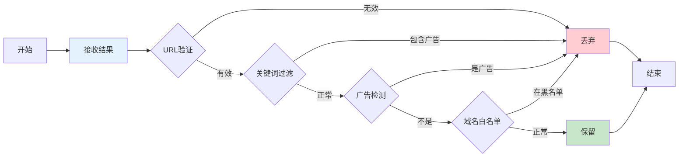

### 广告检测算法

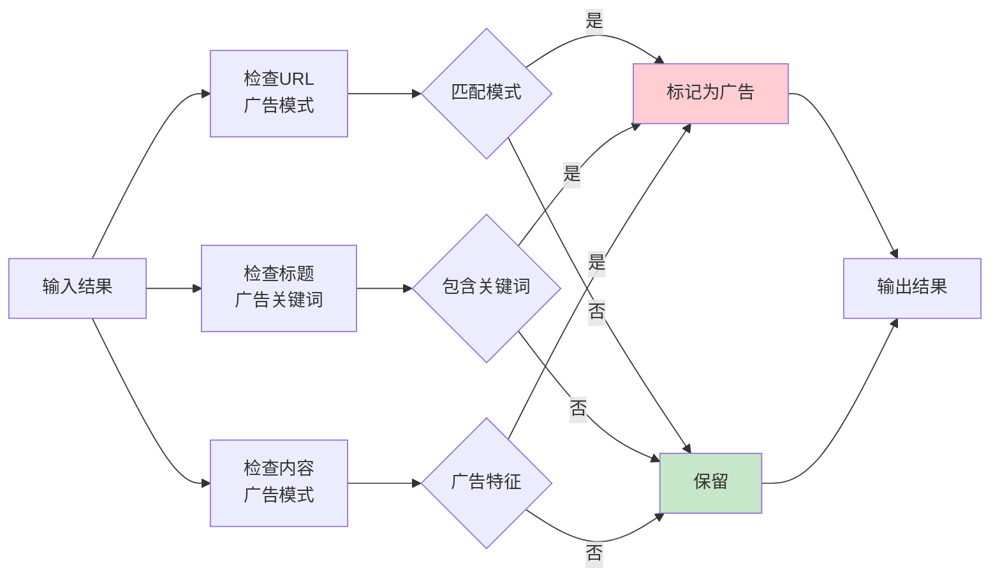

## 结果合并去重

### 去重流程

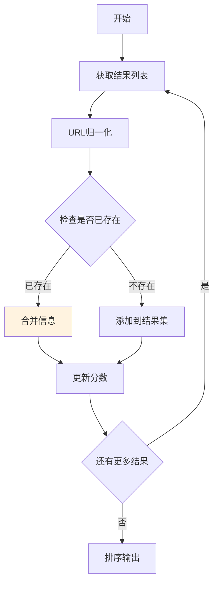

### URL归一化

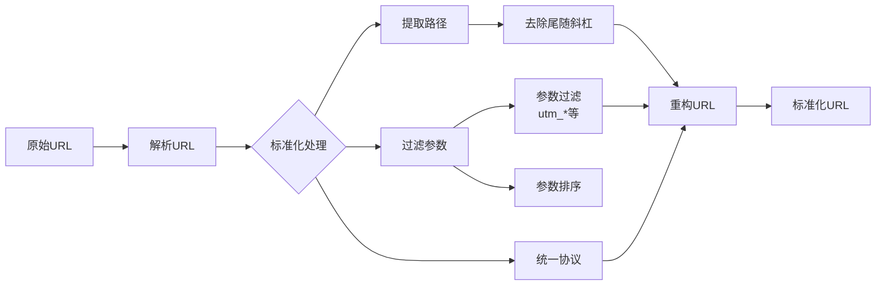

## 评分与排序

### 评分算法

```mermaid
math
    score = engine_weight * (
        1.0 / position + 
        content_length / average_length + 
        thumbnail_bonus
    )
```

### 排序过程

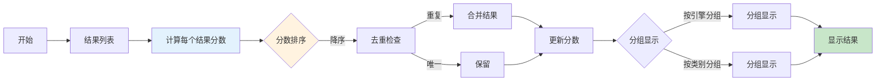

## 并发搜索执行

### 多引擎搜索

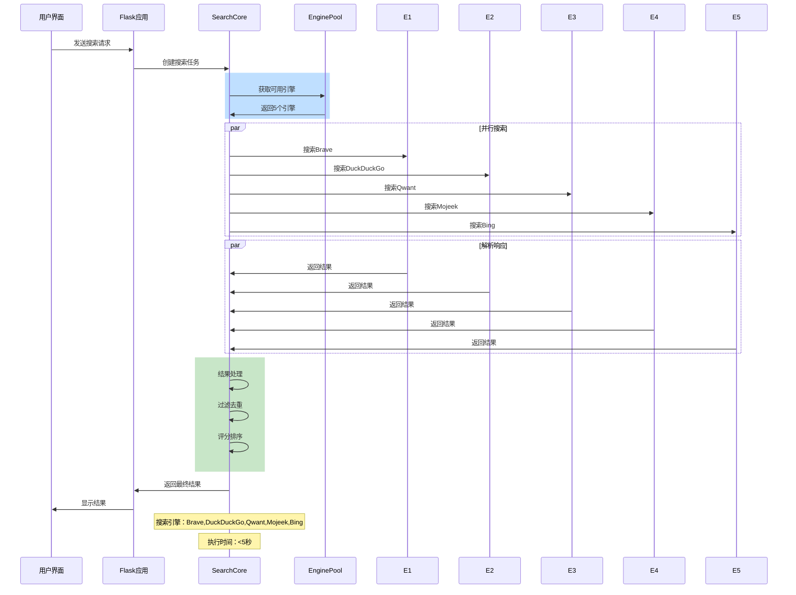

## 架构组件

### SearchCore组件

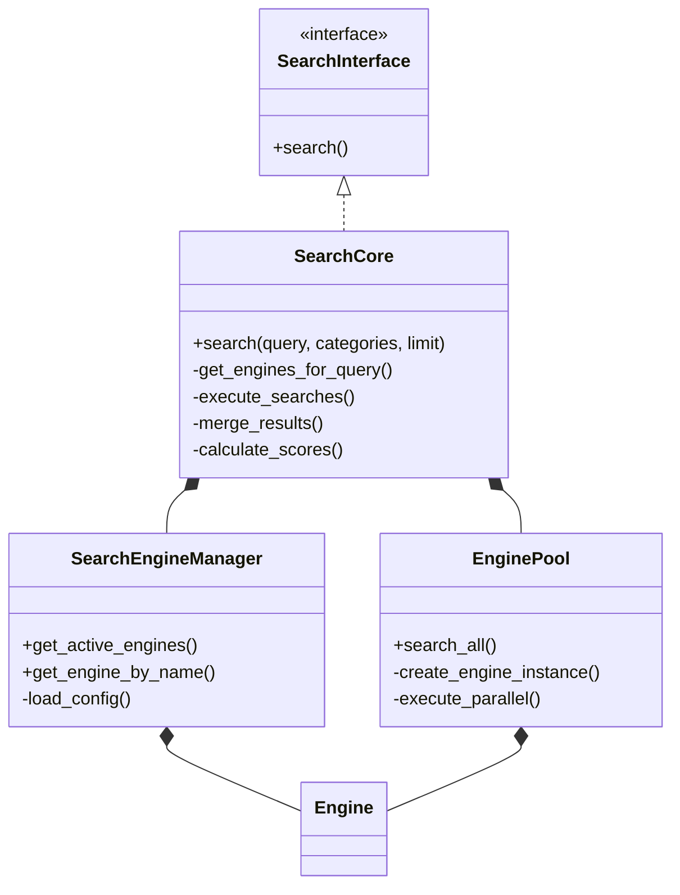

### EngineIntegrations组件

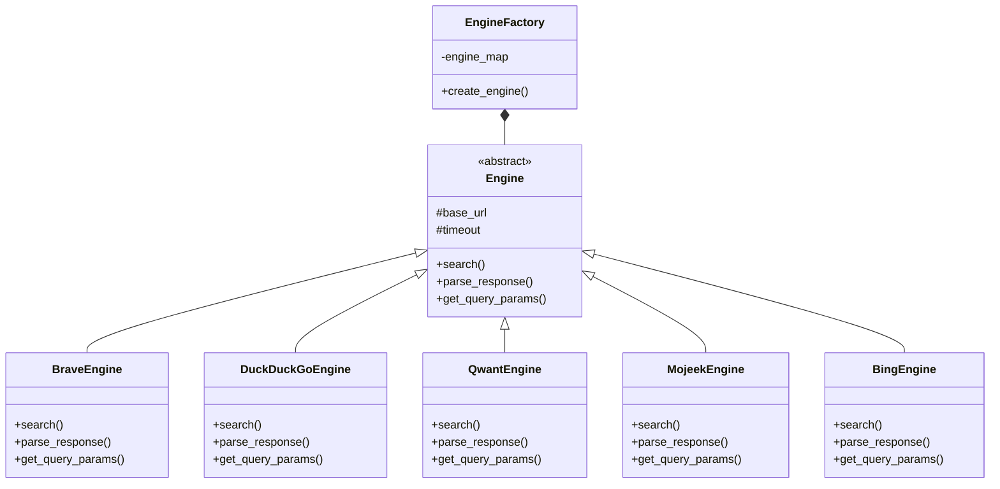

### ResultProcessor组件

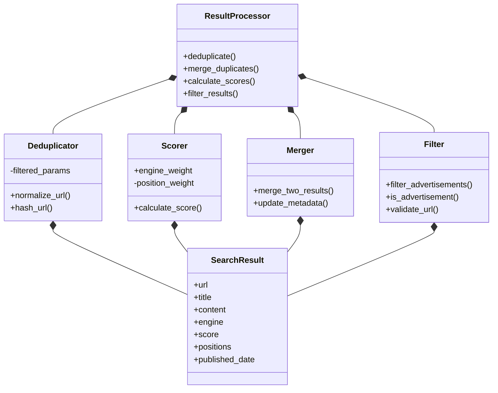

## 数据流程

### 搜索请求流程

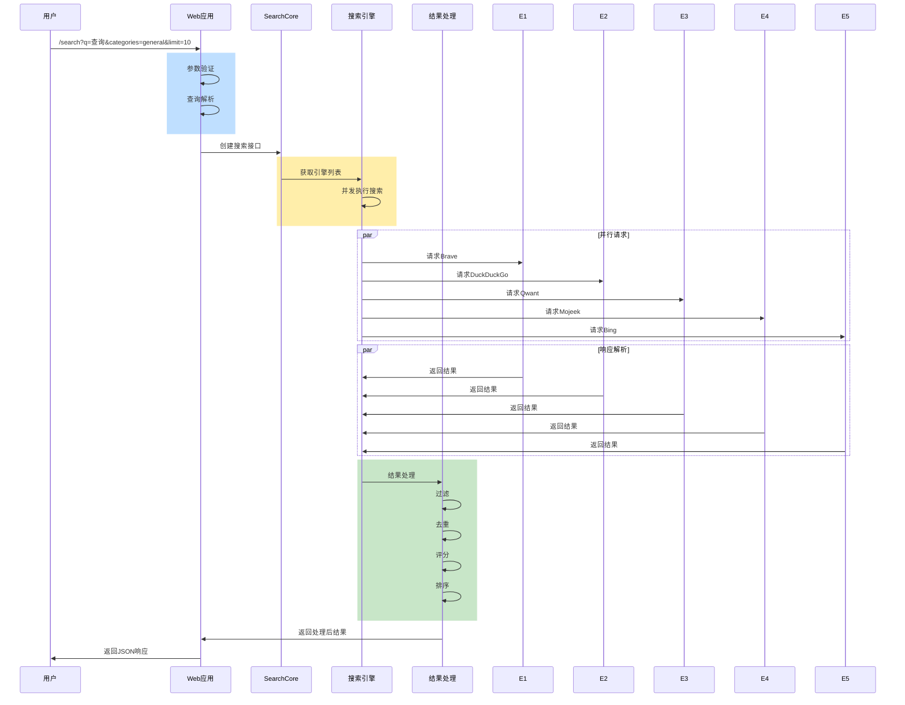

## 性能优化

### 连接池管理

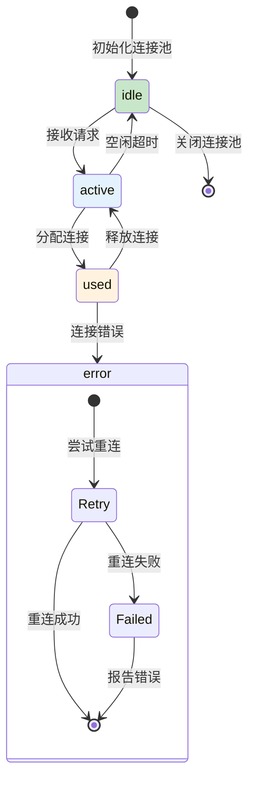

### 响应缓存

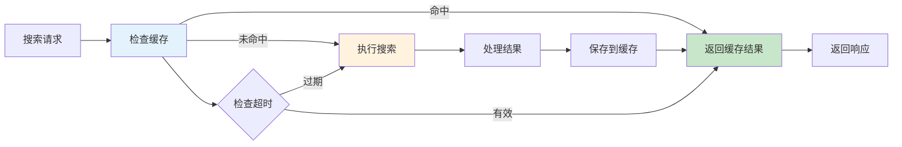

## 部署架构

### 生产部署

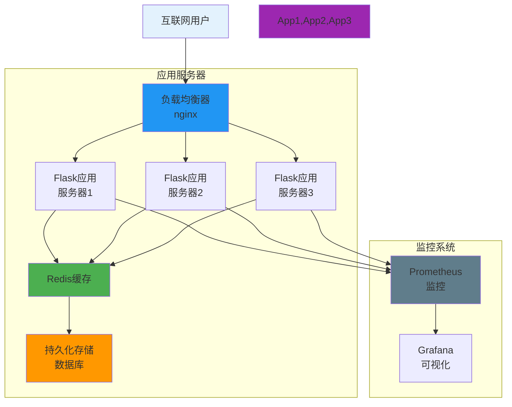

## 技术栈

### 后端

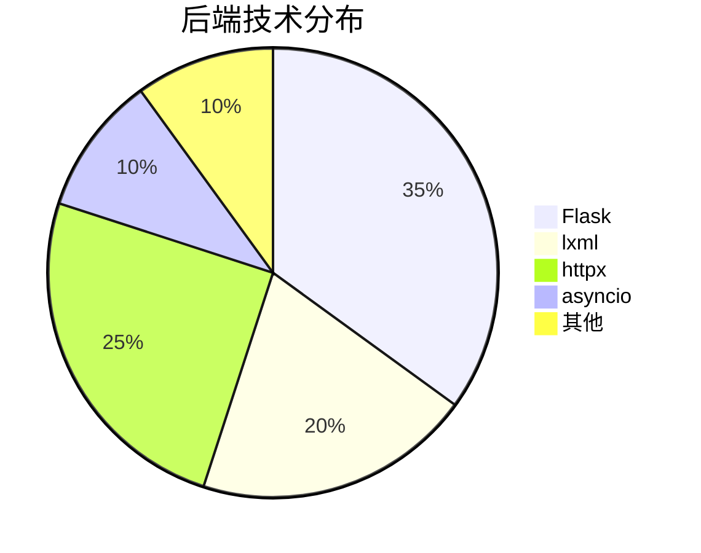

### 前端

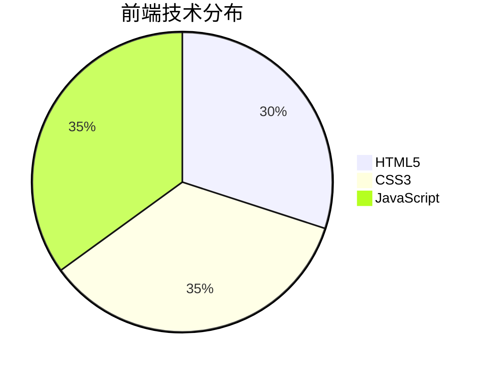

## 实现步骤

### 开发阶段

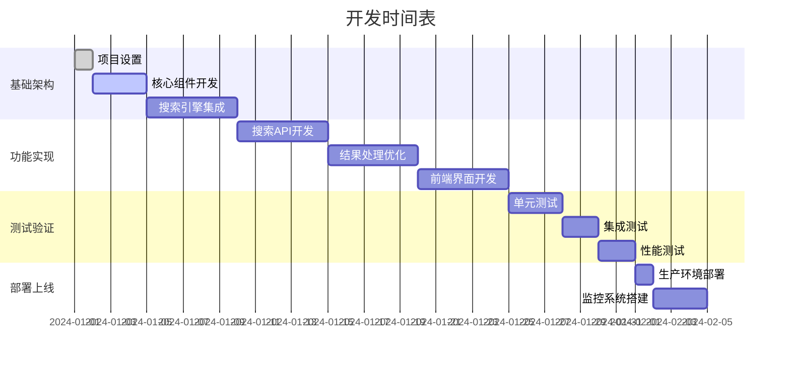

## 总结

本架构设计实现了一个功能完整、性能良好的元搜索引擎，特别针对中国地区进行了优化。我们选择了高质量的搜索引擎，实现了有效的过滤和去重策略，并提供了直观的用户界面。这个实现保留了SearXNG的核心优势，同时简化了复杂度，适合在各种项目中集成使用。
